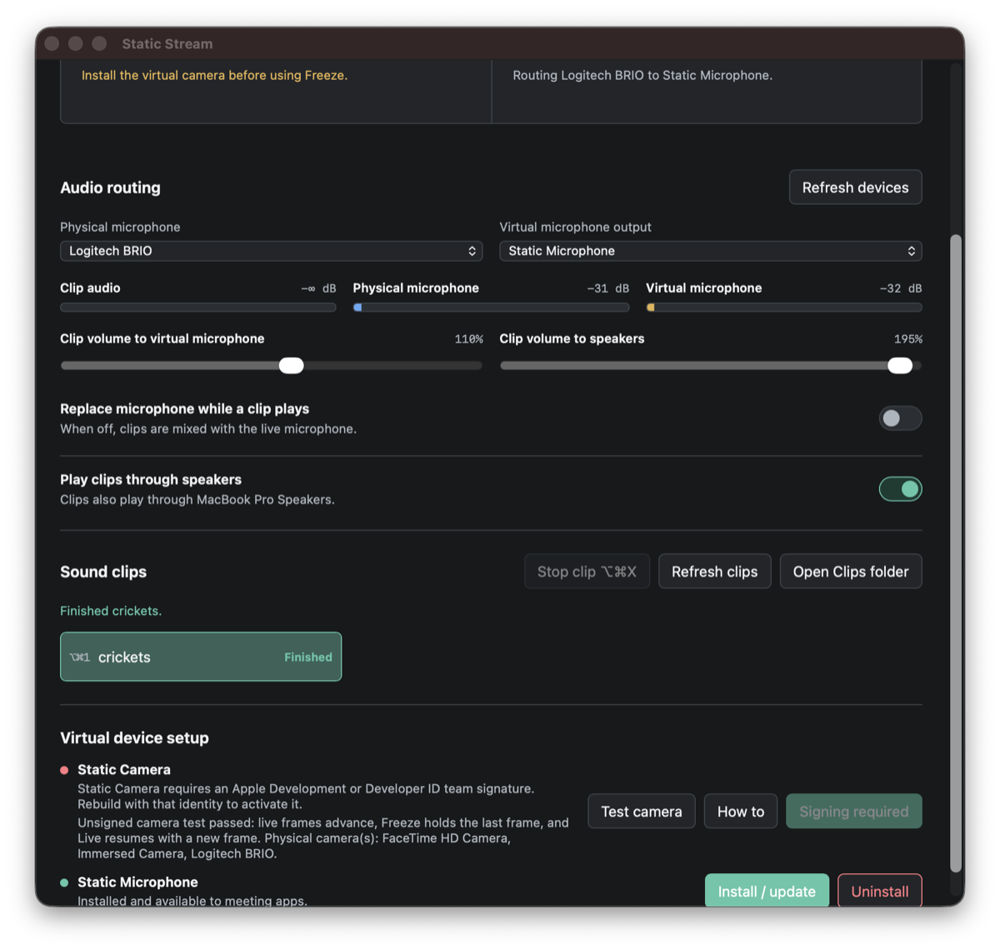
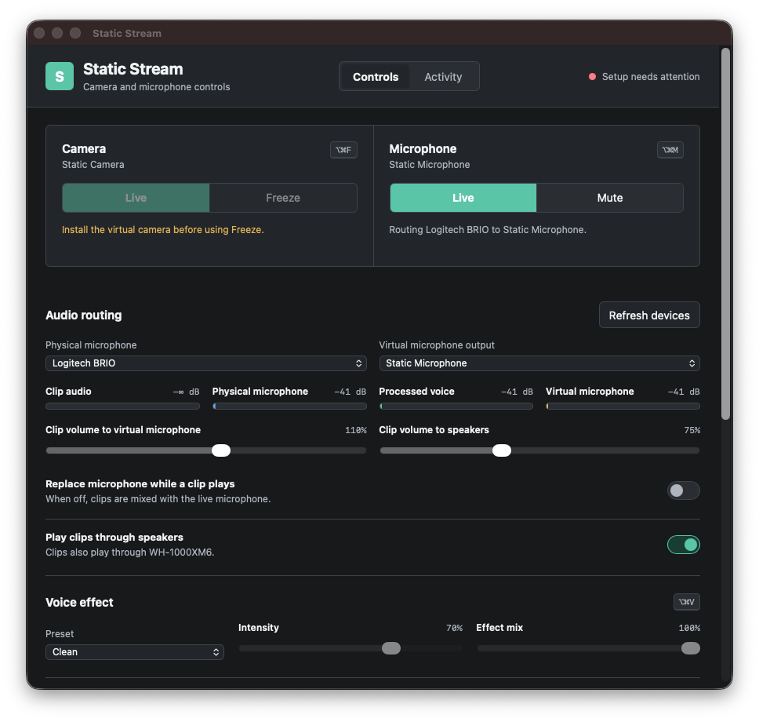

# Static Stream

Static Stream is a keyboard-first macOS app that publishes a controllable virtual camera and
microphone for Zoom, Teams, Discord, browsers, and other meeting software.

The app has a normal control window and a menu-bar item near the clock. It can hold the last camera
frame, pass through or mute a physical microphone, and mix or replace the microphone with sound
clips. Native voice effects can make the microphone sound deep, robotic, anonymous, radio-like,
alien, tiny, or demonic without a model or network service. The control window includes separate
live levels for clip audio, physical input, processed voice, and the final Static Microphone signal.


## Documentation

- [Usage guide](docs/usage.md): installation, keyboard operation, clips, monitoring, and
  troubleshooting
- [Voice effects](docs/voice-effects.md): presets, controls, latency, and troubleshooting
- [Camera signing guide](docs/camera-signing.md): unsigned development test, Apple signing, and
  camera activation
- [Releases and updates](docs/releases.md): GitHub signing secrets, notarized releases, and the
  in-app updater
- [Architecture](docs/architecture.md): processes, data paths, real-time boundaries, and
  portability

## Current Status

| Capability | Status |
| --- | --- |
| macOS control window and menu bar | Implemented |
| Global keyboard shortcuts | Implemented |
| Bundled virtual microphone | Implemented and tested |
| Microphone pass-through, mute, and clips | Implemented and tested |
| Native real-time voice effects | Implemented and tested |
| Audio levels and optional speaker monitoring | Implemented and tested |
| Core Media I/O virtual camera | Implemented; activation requires Apple team signing |
| Apple Silicon and Intel bundle | Implemented |
| Downloadable CI development builds | Implemented for every `main` push |
| Signed GitHub releases and in-app updates | Implemented; publishing requires Apple release secrets |
| Windows and Linux shells | Not implemented |

BlackHole is not required. Static Stream ships its own Core Audio driver named
**Static Microphone**. macOS still requires one administrator-approved installation because
meeting apps only discover microphones published by Core Audio.

## Use Static Stream

For a normal installation, download the universal DMG from
[GitHub Releases](https://github.com/madpin/static-stream/releases), open it, and drag
**Static Stream** to Applications.

Until the first notarized release is published, each successful
[GitHub Actions CI run](https://github.com/madpin/static-stream/actions/workflows/ci.yml) contains a
30-day **Static-Stream-macOS-universal-development** artifact with a universal DMG, ZIP, and
SHA-256 checksums. That ad-hoc build is for development: macOS may require **Open Anyway**, Static
Camera cannot activate, and in-app installation remains disabled.

For a development build:

```sh
./scripts/build-macos.sh
```

Then open [the built app](dist/Static%20Stream.app).

1. In **Virtual device setup**, choose **Install / update** beside **Static Microphone** and approve
   the macOS administrator prompt.
2. Select **Static Microphone** as the microphone in the meeting app.
3. Select the physical microphone in Static Stream.

The installer copies the bundled driver to `/Library/Audio/Plug-Ins/HAL/StaticStreamAudio.driver`
and restarts Core Audio. No third-party audio product is downloaded or required.

The camera has an additional Apple security requirement. A distributable build must be signed by an
Apple development team, placed in `/Applications`, and approved under **System Settings > General >
Login Items & Extensions > Camera Extensions**. Static Stream disables Freeze and explains the
missing step until macOS reports **Static Camera** as an available device.

An unsigned build can still run **Test camera** in the setup panel. That executable exercises the
same live, Freeze, and resume selector compiled into the extension and reports the physical cameras
visible to AVFoundation. It does not publish a virtual camera to other applications; macOS reserves
that system integration for an approved, signed camera extension. See the
[camera signing guide](docs/camera-signing.md) for both paths.



## Install, Update, and Remove Devices

The setup panel and menu-bar menu expose install/update and uninstall actions for both Static
devices. Install/update replaces older Static Stream audio bundles before installing the current
driver, so upgrades do not leave duplicate microphones.

Uninstall asks for confirmation and removes only devices owned by Static Stream:

- **Static Microphone** and the older **Static Stream Microphone** driver bundles are removed from
  `/Library/Audio/Plug-Ins/HAL`.
- **Static Camera** is deactivated using its stable
  `com.madpin.staticstream.camera` system-extension identifier.
- A saved output route pointing to a current or older Static microphone is cleared.

Core Audio is restarted after microphone changes. Camera removal can require approval or a macOS
restart. Static Stream never removes BlackHole or another third-party virtual device.

## Controls

| Command | Shortcut |
| --- | --- |
| Freeze or unfreeze camera | `Option+Command+F` |
| Mute or unmute microphone | `Option+Command+M` |
| Select the next voice effect | `Option+Command+V` |
| Stop the active sound clip | `Option+Command+X` |
| Play clips 1 through 9 | `Option+Command+1` through `9` |
| Quit from the menu | `Command+Q` |

All primary controls are reachable with Tab and the standard macOS keyboard controls. Closing the
window keeps Static Stream running in the menu bar; choose **Open Static Stream** from that menu to
show it again.

Static Stream creates a Clips directory on first launch. Choose **Open Clips folder**, add supported
WAV, MP3, OGG, FLAC, AIFF, CAF, or M4A files, then choose **Refresh clips**. The first nine
alphabetically sorted clips receive number shortcuts.

The control window shows each clip as **Loading**, **Starting**, **Playing**, **Finished**,
**Stopped**, or **Error**. Loading covers decoding, Starting covers the bounded audio queue, and
Playing begins directly from the audio callback acknowledgement. Stop also cancels a clip that is
still decoding, so a late decoder result cannot restart playback.
While a clip is playing, its button background fills from left to right and the button shows the
completed percentage. The progress clock starts from the audio engine's playback acknowledgement,
not from the initial click or decode request.

**Clip volume to microphone** controls how strongly a clip is mixed into Static Microphone.
Enable **Play clips through speakers** to hear the same clip locally, then use **Clip volume to
speakers** for an independent listening level. Speaker monitoring never sends the physical
microphone back to the speakers.

## Voice Effects

Choose Clean, Deep, Robot, Anonymous, Radio, Alien, Tiny, or Demon in the control window or the
menu-bar menu. **Intensity** controls the preset character and **Effect mix** blends it with the
clean microphone. Changes are smoothed and presets crossfade without restarting audio routing.
Sound clips remain unprocessed.



The effects are local Rust DSP and do not require a model download, network connection, or
third-party plug-in. The **Anonymous** preset changes how a voice sounds but does not guarantee
identity protection. See the [voice-effects guide](docs/voice-effects.md).

## Activity Debug Screen

Choose the **Activity** tab in the control window to inspect what Static Stream is doing. Events
cover window, menu, and global-shortcut commands; camera probes and state changes; audio routing;
device discovery; sound clips; configuration saves; and virtual-device installer results.

The screen keeps the newest 250 events in memory, with elapsed time, severity, and category. Filters
show all, informational, warning, or error entries, and **Clear** empties the current log. Device and
clip names can appear in messages, but audio samples are never recorded. Events are discarded when
Static Stream quits and are not written to disk.


## App Updates

Static Stream checks the latest GitHub Release shortly after launch by default. The **App updates**
section shows the current version, available version, release note summary, and update status.
Choose **Check now** for an immediate check. A verified update is installed only after choosing
**Install & restart**.

Automatic installation is enabled only in an Apple-team-signed app bundle running from a writable
installation directory. Development and ad-hoc builds can check for releases, but cannot replace
themselves. Before installation, Static Stream validates the release URL and SHA-256 digest, the
app bundle identifier and version, its Apple Team ID, its complete code signature, and Gatekeeper
assessment. See [Releases and updates](docs/releases.md).

## Development

Prerequisites:

- macOS 12.3 or later
- Rust 1.85 or later
- Xcode command-line tools
- `aarch64-apple-darwin` and `x86_64-apple-darwin` Rust targets for a universal build

Run the controller without bundled installers:

```sh
cargo run --release
```

Build a fast, current-architecture app during iteration:

```sh
UNIVERSAL=0 ./scripts/build-macos.sh
```

Build the default universal app:

```sh
rustup target add aarch64-apple-darwin x86_64-apple-darwin
./scripts/build-macos.sh
```

The build script automatically selects an installed Apple Development, Developer ID Application,
or Apple Distribution identity. Without one it produces an ad-hoc build that runs the GUI and audio
engine but intentionally omits restricted entitlements, so it cannot activate a camera extension.

For the camera, use an Apple Development or Developer ID Application identity whose App ID includes
the System Extension capability for the host and an App Group shared by the host and extension:

```sh
SIGNING_IDENTITY="Apple Development: Your Name (TEAMID)" \
TEAM_IDENTIFIER_PREFIX="TEAMID" \
./scripts/build-macos.sh
```

Move that build to `/Applications` before requesting activation. The team prefix is compiled into
both sides of the app-group channel; this is required for Freeze state to reach the camera
extension. Provisioning profiles can be supplied with `APP_PROVISIONING_PROFILE` and
`CAMERA_PROVISIONING_PROFILE`; the [camera signing guide](docs/camera-signing.md) covers the complete
setup.

## Testing

Run formatting, Clippy, Rust tests, Swift type checks, plist checks, and the in-process audio-driver
loopback test:

```sh
./scripts/check.sh
```

The quality suite also compiles and runs the unsigned camera test. You can run the bundled copy
directly after building:

```sh
"dist/Static Stream.app/Contents/MacOS/static-stream-camera-test"
```

After installing Static Microphone, verify real Core Audio output-to-input samples:

```sh
cargo test --test installed_audio_driver -- --ignored --nocapture
```

Build and signature verification are part of `scripts/build-macos.sh`. CI runs both the quality
suite and the universal bundle build.

## Architecture

```text
Physical camera -> AVFoundation -> Core Media I/O extension -> Static Camera -> meeting app
                                     ^
Control window / menu / hotkey -> app-group freeze state

Physical mic -> CPAL -> resampler -> voice effects -> mixer -> audio driver output
Sound clips -> Symphonia --------------------------------------^
Static Stream Audio driver input -------------------------------> meeting app
```

- `src/audio`: device selection, bounded transport, resampling, voice DSP, and clip mixing
- `src/clips.rs`: clip discovery and Symphonia decoding
- `src/state.rs`: platform-neutral action/effect state machine
- `src/macos.rs`: window, menu bar, hotkeys, installers, and device status
- `src/updates.rs`: release checks, signed-bundle verification, replacement, and rollback
- `assets/app.html`: local WebKit control UI; it has no network dependency
- `platform/macos/audio-driver`: universal AudioServerPlugIn loopback driver
- `platform/macos/camera-extension`: Core Media I/O camera provider

Normal audio callbacks use bounded lock-free buffers and do not allocate. The audio driver stores
two-channel float samples in a fixed lock-free ring. Device enumeration isolates failures so one
malformed third-party endpoint cannot remove all controls.

See [docs/architecture.md](docs/architecture.md) for the component contracts, process boundaries,
and portability plan.

## Troubleshooting

**Static Microphone is missing**

- Choose **Install / update** beside **Static Microphone** and approve the administrator prompt.
- Choose **Refresh devices** after Core Audio restarts.
- Confirm the device in Audio MIDI Setup.
- Re-run the installed-driver test above if the device is visible but silent.

**A sound clip is not heard in the meeting app**

- Check the clip status in the control window. **Error** includes the routing or decoder failure.
- Select **Static Microphone** inside the meeting app, not the physical microphone.
- Confirm Static Stream says it is routing the physical microphone to **Static Microphone**.
- Open **Activity** and check for the clip's decode, playback-started, and playback-finished events.

Static Stream automatically routes only to its own **Static Microphone**. It never silently falls
back to BlackHole or another third-party device. A compatible third-party loopback remains available
as an explicit advanced selection in **Virtual microphone output**.

**Static Camera is missing**

- Confirm the build says it is signed by an Apple team.
- Move the app to `/Applications`.
- Choose **Install / update** beside **Static Camera** and approve it in Camera Extensions settings.
- Restart the meeting app after the camera first appears.

**Freeze is disabled**

Static Stream only enables Freeze after AVFoundation discovers **Static Camera**. This avoids
changing an internal checkbox while the meeting app is still using the physical camera. Select
Static Camera inside the meeting app before freezing.

**Audio feeds back**

Choose a physical device under **Physical microphone**. Static Stream rejects known loopback devices
as microphone sources and prefers its bundled driver as the virtual output.

## Platform Notes

The Rust state, decoding, mixing, resampling, and configuration layers are portable. Windows and
Linux still need native shells and signed virtual-device adapters:

- Linux: PipeWire for audio and `v4l2loopback` for video
- Windows: WASAPI/APO audio endpoint and Media Foundation virtual camera

Apple recommends a Core Audio AudioServerPlugIn for a virtual audio device and Core Media I/O
extensions for virtual cameras. See
[Creating an Audio Server Driver Plug-in](https://developer.apple.com/documentation/coreaudio/creating-an-audio-server-driver-plug-in),
[Creating a camera extension with Core Media I/O](https://developer.apple.com/documentation/coremediaio/creating-a-camera-extension-with-core-media-i-o),
and
[Installing System Extensions and Drivers](https://developer.apple.com/documentation/systemextensions/installing-system-extensions-and-drivers).
