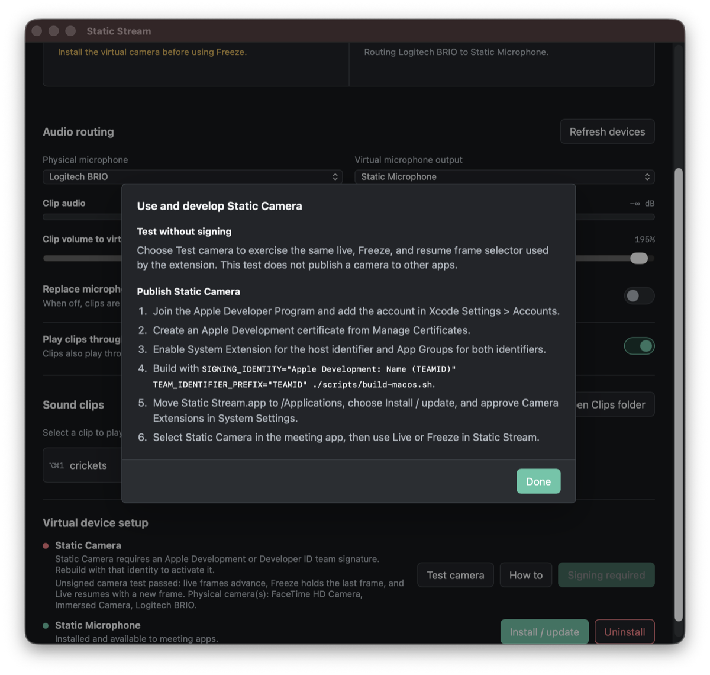

# Camera Development And Signing

Static Stream supports two camera-development paths:

- **Unsigned logic test**: available immediately and suitable for testing the live, Freeze, and
  resume frame-selection behavior.
- **Signed system-extension test**: required before macOS can publish **Static Camera** to Zoom,
  Teams, Discord, browsers, or another application.

The unsigned path is deliberately not presented as a virtual camera. macOS loads Core Media I/O
camera extensions out of process and validates their identity and entitlements.


## Test Without Signing

In the app, open **Virtual device setup** and choose **Test camera**. The result reports:

- whether live frames advance;
- whether Freeze holds the last frame;
- whether returning to Live accepts a new frame;
- the physical cameras AVFoundation can currently enumerate.

The helper compiles the same `FreezeFrameSelector.swift` source as the camera extension. It can also
be run from the terminal:

```sh
./scripts/check.sh
```

Or, after building the app:

```sh
"dist/Static Stream.app/Contents/MacOS/static-stream-camera-test"
```

This is useful for normal development and CI without weakening System Integrity Protection. It does
not test system-extension activation, cross-process app-group state, or discovery by meeting apps.
Those require the signed path below.

## Apple Account And Certificates

For local device testing:

1. Join the Apple Developer Program.
2. In Xcode, open **Settings > Accounts** and add the Apple ID.
3. Select the team, choose **Manage Certificates**, and create an **Apple Development**
   certificate.
4. In Certificates, Identifiers & Profiles, register the host App ID
   `com.madpin.staticstream`.
5. Enable **System Extension** on the host identifier.
6. Register the camera-extension identifier `com.madpin.staticstream.camera`.
7. Create one App Group shared by both identifiers:
   `TEAMID.group.com.madpin.staticstream`.
8. Create development provisioning profiles whose entitlements match the host and camera
   extension.

The host uses the `com.apple.developer.system-extension.install` entitlement. Both bundles use the
same `com.apple.security.application-groups` value. The camera extension is sandboxed and receives
camera access through `com.apple.security.device.camera`.

For distribution outside the Mac App Store, use a **Developer ID Application** certificate and
Apple's notarization workflow instead of shipping a development-signed build. Do not distribute an
ad-hoc or Apple Development build. The complete GitHub Actions setup is documented in
[Releases and updates](releases.md).

## Build A Signed Development App

First inspect available signing identities:

```sh
security find-identity -v -p codesigning
```

Build with the certificate's exact displayed name and the ten-character team identifier:

```sh
SIGNING_IDENTITY="Apple Development: Your Name (TEAMID)" \
TEAM_IDENTIFIER_PREFIX="TEAMID" \
APP_PROVISIONING_PROFILE="/path/to/Static_Stream_Development.provisionprofile" \
CAMERA_PROVISIONING_PROFILE="/path/to/Static_Camera_Development.provisionprofile" \
./scripts/build-macos.sh
```

The provisioning-profile variables are optional only when the selected signing setup does not
require embedded profiles. Supplying them makes the inputs explicit and causes the build to fail
early when either path is invalid.

The build script:

1. compiles universal Apple Silicon and Intel binaries by default;
2. substitutes the team prefix into the app group and camera Mach service;
3. embeds optional host and extension provisioning profiles;
4. signs nested helpers, the audio driver, the camera extension, and the host in inside-out order;
5. verifies the complete bundle with `codesign --deep --strict`.

## Verify Before Activation

```sh
codesign --verify --deep --strict --verbose=2 "dist/Static Stream.app"
codesign -d --entitlements :- "dist/Static Stream.app"
codesign -d --entitlements :- \
  "dist/Static Stream.app/Contents/Library/SystemExtensions/com.madpin.staticstream.camera.systemextension"
```

Confirm the host output contains the system-extension install entitlement and both entitlement
outputs contain the identical team-prefixed app group.

## Install And Approve

1. Quit older copies of Static Stream.
2. Move the signed app to `/Applications/Static Stream.app`.
3. Open that copy.
4. In **Virtual device setup**, choose **Install / update** beside Static Camera.
5. Approve the request under **System Settings > General > Login Items & Extensions > Camera
   Extensions** when macOS asks.
6. Choose **Refresh devices**.
7. Restart the meeting app, select **Static Camera**, and use Live/Freeze in Static Stream.



## Troubleshooting

### The App Still Says Signing Required

Confirm you opened `/Applications/Static Stream.app`, not an older ad-hoc copy in `dist`. Run:

```sh
codesign -dv --verbose=4 "/Applications/Static Stream.app" 2>&1
```

The output should show the expected `TeamIdentifier`, not `TeamIdentifier=not set`.

### Activation Is Rejected

Check the **Activity** tab, then verify:

- the host and extension have the same team identifier;
- the host has the system-extension entitlement;
- both bundles have the identical app group;
- both provisioning profiles authorize their respective entitlements;
- the app is in `/Applications`;
- the extension was approved in System Settings.

### Static Camera Is Installed But Missing In One App

Quit and reopen that app so it enumerates capture devices again. Also check that another copy of
Static Stream with the same bundle identifier is not running.

### Freeze Changes The UI But Not The Video

The meeting app must be using **Static Camera**, not the physical camera. Confirm the setup panel
reports Static Camera as available before Freeze is enabled.

## Apple References

- [Core Media I/O](https://developer.apple.com/documentation/coremediaio)
- [Creating a camera extension with Core Media I/O](https://developer.apple.com/documentation/coremediaio/creating-a-camera-extension-with-core-media-i-o)
- [Signing a Mac product archive](https://help.apple.com/xcode/mac/current/en.lproj/dev60b6fbbc7.html)
- [Create and manage signing certificates](https://help.apple.com/xcode/mac/current/en.lproj/dev154b28f09.html)
- [Create Developer ID certificates](https://developer.apple.com/help/account/certificates/create-developer-id-certificates/)
- [Enable app capabilities](https://developer.apple.com/help/account/identifiers/enable-app-capabilities/)
- [Configure App Groups](https://developer.apple.com/documentation/xcode/configuring-app-groups)
- [Create a development provisioning profile](https://developer.apple.com/help/account/provisioning-profiles/create-a-development-provisioning-profile/)
