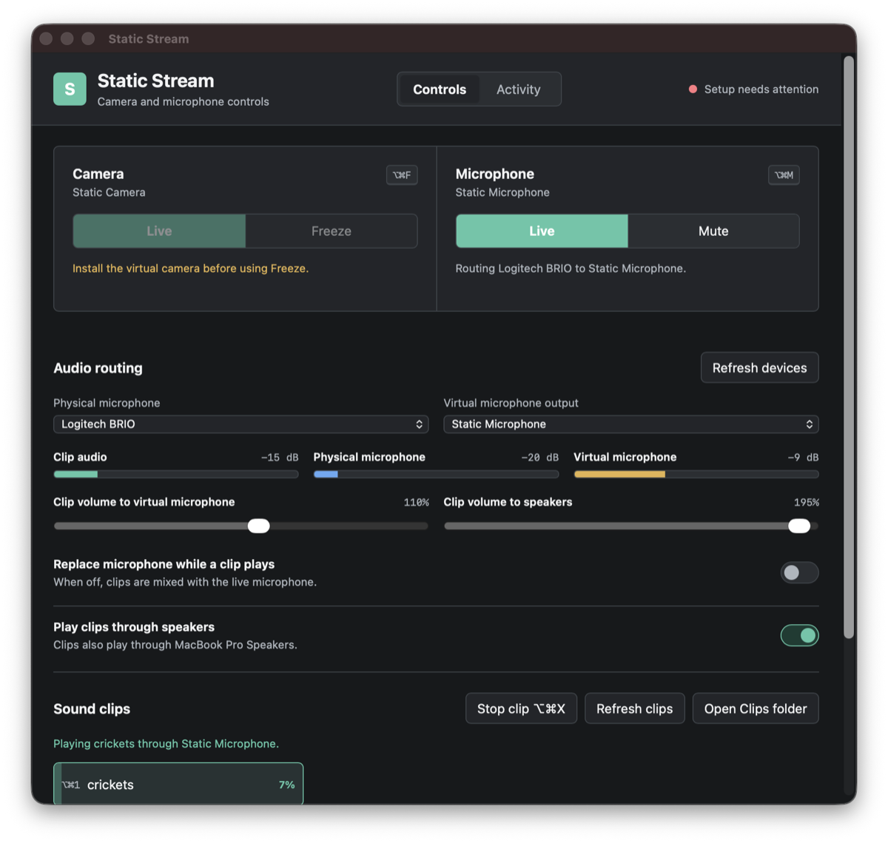
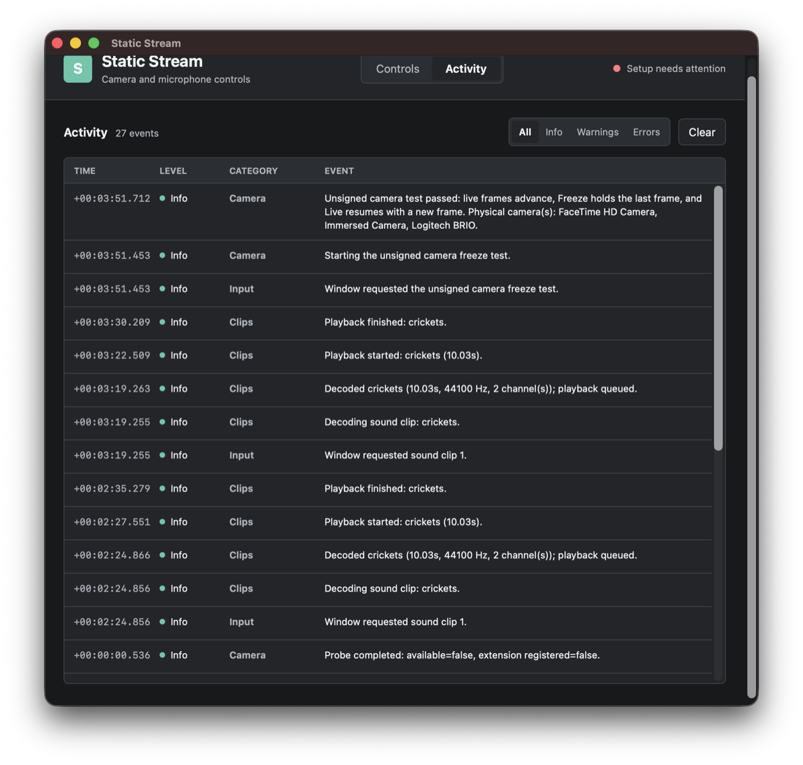

# Using Static Stream

Static Stream publishes **Static Microphone** and, when Apple-signed and approved, **Static
Camera**. The controller stays available both as a normal window and as a menu near the macOS clock.
BlackHole is not required.

## First Run

1. Open `Static Stream.app`.
2. In **Virtual device setup**, choose **Install / update** beside **Static Microphone**.
3. Approve the administrator prompt. Static Stream installs its bundled Core Audio driver and
   restarts Core Audio.
4. Choose **Refresh devices**.
5. Select a physical microphone and **Static Microphone** in **Audio routing**.
6. In Zoom, Teams, Discord, or the browser, select **Static Microphone** instead of the physical
   microphone.

The camera requires a build signed for an Apple development team. The setup panel detects unsigned
builds, offers a development test, and links to an in-app signing guide. See
[Camera development and signing](camera-signing.md).

## Keyboard Operation

All controls use standard macOS keyboard navigation. Enable **Keyboard navigation** in
**System Settings > Keyboard** if Tab does not focus every control.

| Action | Shortcut |
| --- | --- |
| Freeze or resume Static Camera | `Option+Command+F` |
| Mute or resume Static Microphone | `Option+Command+M` |
| Select the next voice effect | `Option+Command+V` |
| Play clips 1 through 9 | `Option+Command+1` through `9` |
| Stop the active clip | `Option+Command+X` |
| Move between controls | `Tab` / `Shift+Tab` |
| Activate the focused control | `Space` |
| Quit from the menu | `Command+Q` |

Closing the window does not quit the app. Choose **Open Static Stream** from the menu-bar item to
show it again.

## App Updates

**App updates** displays the installed version and update status.

- Keep **Check automatically** enabled to check the latest GitHub Release shortly after launch.
- Choose **Check now** to check immediately.
- When a newer signed release is available, choose **Install & restart** to download, verify,
  replace, and reopen the app.
- The menu-bar menu also contains **Check for updates...**.

Static Stream never installs an update silently. An ad-hoc or unbundled development build can check
for updates, but the install button remains disabled because that build has no stable Apple Team
identity. See [Releases and updates](releases.md) for the signing requirements and verification
model.

## Camera

Select **Static Camera** in the meeting app before using Freeze. Static Stream enables Freeze only
after AVFoundation discovers the installed virtual camera.

- **Live** forwards current physical-camera frames.
- **Freeze** holds the last frame received before Freeze.
- Returning to **Live** immediately resumes current frames.

**Test camera** is available in unsigned development builds. It verifies the shared frame-selection
logic but cannot make an unsigned virtual camera appear to another app.

## Microphone, Voice Effects, And Levels

The four meters represent different points in the audio path:

- **Clip audio**: decoded sound-clip signal after clip gain.
- **Physical microphone**: live microphone input.
- **Processed voice**: physical microphone after the selected voice effect.
- **Virtual microphone**: final mixed or replaced signal written to Static Microphone.

Choose Clean, Deep, Robot, Anonymous, Radio, Alien, Tiny, or Demon under **Voice effect**.
**Intensity** controls the preset character and **Effect mix** blends it with the physical
microphone. Sound clips are mixed later and are not changed by voice effects. See
[Voice effects](voice-effects.md) for preset details and latency behavior.

**Clip volume to virtual microphone** changes the clip level sent to the meeting app. Values above
100% add gain and may clip if the source is already loud.

Enable **Replace microphone while a clip plays** to silence the physical microphone for the clip's
duration. Leave it off to mix the clip with live speech.

Enable **Play clips through speakers** for local monitoring. **Clip volume to speakers** is
independent of the virtual-microphone gain. Static Stream monitors clip audio only, so it does not
feed the physical microphone back through the speakers.

## Sound Clips

1. Choose **Open Clips folder**.
2. Add WAV, MP3, OGG, FLAC, AIFF, CAF, or M4A files.
3. Choose **Refresh clips**.
4. Activate a clip button or use its displayed number shortcut.

The button shows **Loading** while the file is decoded and **Starting** while the decoded samples
wait for the next audio callback. During playback, its accent background fills from left to right
and the trailing label shows playback percentage. The fill begins when the audio engine confirms
playback, so decode and device-start time are not incorrectly counted as played audio. A completed
clip remains fully filled and shows **Finished** until the next clip action.

Choose **Stop clip** to stop playback, including a clip that is still decoding.

## Device Maintenance

Use **Install / update** to replace the current Static device and supported older Static Stream
versions. Use **Uninstall** to remove the selected Static device.

Static Stream may remove these owned legacy audio bundle names during an update:

- `StaticStreamAudio.driver`
- older bundles that published **Static Stream Microphone**

It never removes BlackHole or another third-party loopback driver. Camera uninstall targets only the
stable `com.madpin.staticstream.camera` system-extension identifier.

## Activity

The **Activity** tab shows the newest 250 controller events. It records commands, clip decode and
playback transitions, device probes, routing changes, installers, and camera tests.

Use **Info**, **Warnings**, and **Errors** to narrow the list. Events remain in memory only and are
discarded when Static Stream quits. Audio samples are never logged.

## Troubleshooting

### Static Microphone Is Missing

1. Choose **Install / update** and approve the administrator prompt.
2. Wait for Core Audio to restart, then choose **Refresh devices**.
3. Confirm **Static Microphone** appears in Audio MIDI Setup.
4. Restart an already-running meeting app so it enumerates the new device.

### A Clip Is Visible But Silent In The Meeting App

1. Confirm the meeting app uses **Static Microphone**, not the physical microphone.
2. Confirm the routing message names both the physical microphone and Static Microphone.
3. Watch **Clip audio** and **Virtual microphone** while the clip plays.
4. Check **Activity** for decode, playback-started, and playback-finished events or a routing error.

### A Voice Effect Is Not Audible

1. Confirm the meeting app uses **Static Microphone**, not the physical microphone.
2. Select a preset other than Clean and set Intensity and Effect mix above zero.
3. Compare the Physical microphone and Processed voice meters.
4. Check Activity for the preset request and audio-engine activation.

### Local Clip Monitoring Is Silent

Confirm **Play clips through speakers** is enabled and the speaker level is above zero. Static Stream
uses the current default output device and reports output-stream failures in **Activity**.

### Static Camera Is Missing

Follow [Camera development and signing](camera-signing.md). After first activation, approve the
extension in **System Settings > General > Login Items & Extensions > Camera Extensions**, then
restart the meeting app.

### Audio Feeds Back

Select a real hardware microphone under **Physical microphone**. Static Stream rejects known
loopback endpoints as physical inputs, but explicit third-party routing can still create a cycle.
